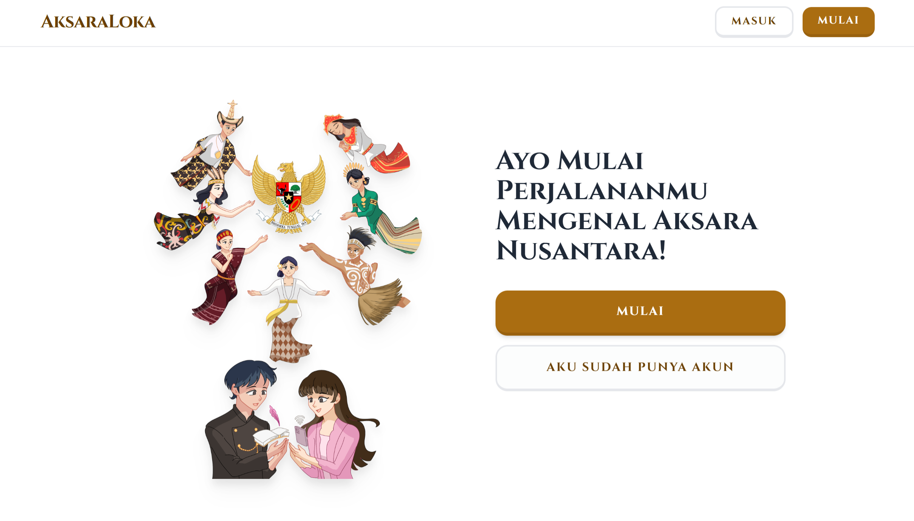

<p align="center">
  <h1>🌐 AksaraLoka Web Project</h1>
  <p align="center"><i>Platform Pembelajaran Bahasa Daerah Berbasis Web</i></p>
</p>

<p align="center">
  
</p>

<p align="center">
  Universitas Pembangunan Nasional “Veteran” Jawa Timur <br>
  Fakultas Ilmu Komputer <br>
  Program Studi Sistem Informasi
</p>

<hr>

## 📌 Tentang Proyek

**AksaraLoka** adalah platform berbasis web yang dirancang untuk membantu pengguna dalam mempelajari dan melestarikan bahasa daerah, khususnya bahasa Jawa, melalui pendekatan interaktif dan modern.

Proyek ini dikembangkan sebagai bagian dari tugas mata kuliah **Pemrograman Website**, sekaligus sebagai langkah awal menuju pengembangan produk digital yang memiliki dampak nyata dalam pelestarian budaya lokal.

---

## 🚀 Fitur Utama

* 📖 Pembelajaran kosakata bahasa daerah
* 🧠 Quiz interaktif untuk menguji pemahaman
* 🔍 Pencarian kata (Indonesia ↔ Jawa)
* 🎯 Sistem gamifikasi sederhana (score / progress)
* 💻 Antarmuka modern berbasis web

---

## 🛠️ Teknologi yang Digunakan

| Teknologi      | Deskripsi        |
| -------------- | ---------------- |
| HTML           | Struktur halaman |
| CSS / Tailwind | Styling & UI     |
| JavaScript     | Interaktivitas   |
| PHP            | Backend logic    |
| MySQL          | Database         |

---

## 📂 Struktur Proyek

```
aksaraloka/
│── assets/        # Gambar, icon, dll
│── pages/         # Halaman utama
│── config/        # Koneksi database
│── index.html     # Halaman utama
```

---

## 👥 Tim Pengembang
| Nama                | NPM         | GitHub                                      |
| ------------------- | ----------- | -------------------------------------------- |
| Dwiki Aulia Rahman  | 24082010153 | [@auliadwiki54](https://github.com/auliadwiki54) |
| Zaki Wira Laksamana | 24082010155 | [@Revio225](https://github.com/Revio225)     |
| Hafid Fathurohman   | 24082010165 | [@razorx411](https://github.com/razorx411)   |
---

## 🎯 Tujuan Proyek

* Mengembangkan aplikasi web berbasis pembelajaran
* Meningkatkan kemampuan pengembangan fullstack
* Menciptakan solusi digital untuk pelestarian budaya lokal

---

## 📈 Pengembangan Selanjutnya

* 🔥 Integrasi API terjemahan
* 📱 Responsive mobile app
* 🧑‍🤝‍🧑 Sistem akun & leaderboard
* 🤖 AI untuk rekomendasi pembelajaran

---

## 📸 Preview


---

📦 AksaraLoka Backend - Local Setup Guide
🚀 Persiapan Awal
Pastikan kamu sudah install:


Laragon / XAMPP / LAMP


PHP (>= 7.4)


MySQL / MariaDB


Browser (Chrome/Edge)


📁 Struktur Project
aksaraloka/│├── api/                # File backend PHP (endpoint API)├── config/│   └── db.php          # Koneksi database├── assets/             # Gambar, CSS, dll├── pages/              # Frontend (HTML, JS)├── .env                # Config database (jangan upload ke GitHub)└── index.html

⚙️ Setup Database
1. Jalankan Server


Buka Laragon/XAMPP


Start:


Apache


MySQL


2. Buat Database
Buka:
http://localhost/phpmyadmin
Lalu:


Klik New


Nama database:


aksaraloka_db

3. Import Database (Jika Ada)


Klik database aksaraloka_db


Klik Import


Upload file .sql


🔐 Konfigurasi .env
Buat file .env di root project:
DB_HOST=localhostDB_USER=rootDB_PASS=DB_NAME=aksaraloka_db
⚠️ JANGAN upload file ini ke GitHub
Tambahkan ke .gitignore:
.env

🔌 Setup Koneksi Database
config/db.php
<?php$host = 'localhost';$user = 'root';$pass = '';$db   = 'aksaraloka_db';$conn = new mysqli($host, $user, $pass, $db);if ($conn->connect_error) {    die("Koneksi gagal: " . $conn->connect_error);}?>

📡 Contoh Endpoint API
api/getUser.php
<?phpinclude '../config/db.php';$result = $conn->query("SELECT * FROM users");$data = [];while ($row = $result->fetch_assoc()) {    $data[] = $row;}echo json_encode($data);?>

🌐 Jalankan Project
Jika pakai Laragon:
http://localhost/aksaraloka

🔄 Integrasi Frontend (Fetch API)
Contoh di JS:
fetch('http://localhost/aksaraloka/api/getUser.php')  .then(res => res.json())  .then(data => {    console.log(data);  });

❗ Troubleshooting
❌ Koneksi Database Gagal


Cek MySQL sudah jalan


Cek username/password


Cek nama database


❌ API Tidak Bisa Diakses


Pastikan path benar:


/api/namafile.php

❌ Error CORS (Jika beda port)
Tambahkan di PHP:
header("Access-Control-Allow-Origin: *");

💡 Best Practice


Pisahkan frontend (pages) dan backend (api) ✔️


Jangan hardcode database di banyak file ❌


Gunakan 1 file koneksi (db.php) ✔️


Gunakan .env untuk keamanan ✔️


🧠 Catatan Developer
Project ini menggunakan:


PHP Native (Backend)


MySQL (Database)


Fetch API (Frontend)


Arsitektur:
Frontend (HTML + JS)        ↓Fetch API        ↓Backend PHP (api/)        ↓Database MySQL

## 📜 Lisensi

Proyek ini dikembangkan untuk keperluan akademik dan pembelajaran.

---

<p align="center">
  ✨ "Melestarikan budaya melalui teknologi" ✨
</p>
