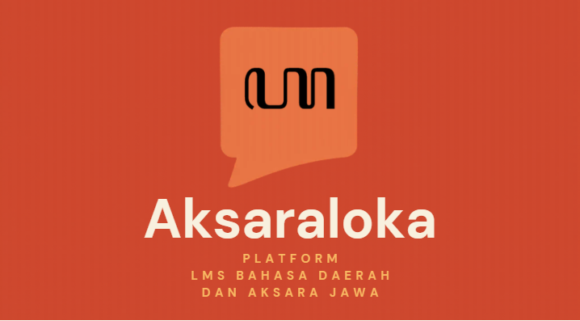

  <h1>🌐 AksaraLoka Web Project</h1>

## 📌 Tentang Proyek

**AksaraLoka** adalah platform berbasis web yang dirancang untuk membantu pengguna dalam mempelajari dan melestarikan bahasa daerah, khususnya bahasa Jawa, melalui pendekatan interaktif dan modern.

Proyek ini dikembangkan sebagai bagian dari tugas mata kuliah **Pemrograman Website**, sekaligus sebagai langkah awal menuju pengembangan produk digital yang memiliki dampak nyata dalam pelestarian budaya lokal.

---

## 👥 Tim Pengembang
| Nama                | NPM         | GitHub                                      |
| ------------------- | ----------- | -------------------------------------------- |
| Dwiki Aulia Rahman  | 24082010153 | [@auliadwiki54](https://github.com/auliadwiki54) |
| Zaki Wira Laksamana | 24082010155 | [@Revio225](https://github.com/Revio225)     |
| Hafid Fathurohman   | 24082010165 | [@razorx411](https://github.com/razorx411)   |
---

